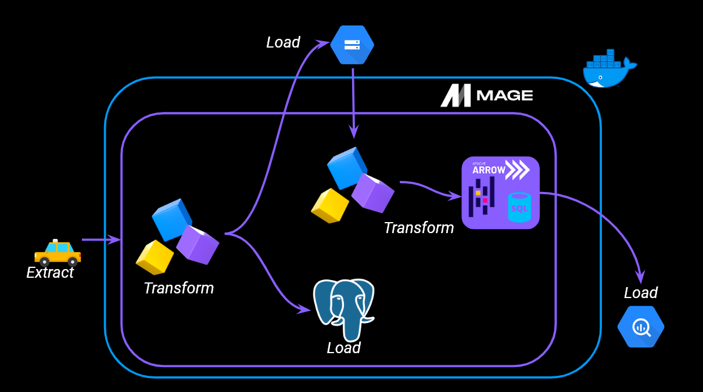
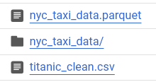
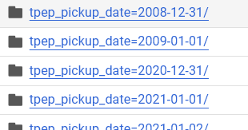
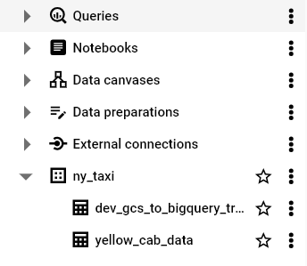

# Create data pipeline using Mage
In this module we will created data pipeline using Mage.

## what is Mage
Mage is an open-source pipeline tools for orchestrating, transforming, and integrating data.
[Learn More!](https://docs.mage.ai/introduction/overview)

## Overview


### Setting up Mage and Postgres

Cloning the repo:

```bash
git clone https://github.com/mage-ai/mage-zoomcamp.git mage-zoomcamp
```

Navigate to the repo:

```bash
cd mage-data-engineering-zoomcamp
```

Rename `dev.env` to `.env`

Build the container

```bash
docker compose build
```

Start the Docker container:

```bash
docker compose up
```

Now open mage at http://localhost:6789

Add new user name `dev` in Mage file.

```bash
dev:
  # PostgresSQL
  POSTGRES_CONNECT_TIMEOUT: 10
  POSTGRES_DBNAME: "{{ env_var('POSTGRES_DBNAME') }}"
  POSTGRES_SCHEMA: "{{ env_var('POSTGRES_SCHEMA') }}"
  POSTGRES_USER: "{{ env_var('POSTGRES_USER') }}"
  POSTGRES_PASSWORD: "{{ env_var('POSTGRES_PASSWORD') }}"
  POSTGRES_HOST: "{{ env_var('POSTGRES_HOST') }}"
  POSTGRES_PORT: "{{ env_var('POSTGRES_PORT') }}"
```
### Setting GCP
* Create Bucket
* Creat Service Account
Give role = owner (for education only)
* Get the key and paste it in mage working directory
* Add path to service key in mage file(localhost:6789)
Path can be see in Mage Terminal
```bash
GOOGLE_SERVICE_ACC_KEY_FILEPATH: "path to json key file"
```

To check whether gcp is connect or not go in to `test_config` pipeline and try load data from bucket(put titanic_clean.csv in there first).
```bash
@data_loader
def load_from_google_cloud_storage(*args, **kwargs):
    """
    Template for loading data from a Google Cloud Storage bucket.
    Specify your configuration settings in 'io_config.yaml'.

    Docs: https://docs.mage.ai/design/data-loading#googlecloudstorage
    """
    config_path = path.join(get_repo_path(), 'io_config.yaml')
    config_profile = 'default'

    bucket_name = 'your bucket name'
    object_key = 'titanic_clean.csv'

    return GoogleCloudStorage.with_config(ConfigFileLoader(config_path, config_profile)).load(
        bucket_name,
        object_key,
    )
```

If success the data will be shown to you
## Get Started
### 1.Extract Data
* Get data from api
* Specify data type
* Transform datetime columns

```bash
@data_loader
def load_data_from_api(*args, **kwargs):
    """
    Template for loading data from API
    """
    url = 'https://github.com/DataTalksClub/nyc-tlc-data/releases/download/yellow/yellow_tripdata_2021-01.csv.gz'

    taxi_dtypes = {
                    'VendorID': pd.Int64Dtype(),
                    'passenger_count': pd.Int64Dtype(),
                    'trip_distance': float,
                    'RatecodeID': pd.Int64Dtype(),
                    'store_and_fwd_flag': str,
                    'PULocationID': pd.Int64Dtype(),
                    'DOLocationID': pd.Int64Dtype(),
                    'payment_type': pd.Int64Dtype(),
                    'fare_amount': float,
                    'extra': float,
                    'mta_tax': float,
                    'trip_amount':float,
                    'tolls_amount': float,
                    'improvement_surcharge':float,
                    'total_amount':float,
                    'congestion_surcharge':float
                }

    parse_dates = ['tpep_pickup_datetime', 'tpep_dropoff_datetime']   

    return pd.read_csv(url, sep = ",", compression = "gzip", dtype = taxi_dtypes, parse_dates = parse_dates)
```
### 2. Transform data
Check if data has anomaly

```bash
@transformer
def transform(data, *args, **kwargs):

    print("Rows with zero passengers",data['passenger_count'].isin([0]).sum())

    

    # Specify your transformation logic here

    return data[data['passenger_count'] > 0]


@test
def test_output(output, *args) -> None:

    assert output['passenger_count'].isin([0]).sum() ==0, 'There are rides with zero passengers'

```

### 3.1. Load to Postgres with given parameter
```bash
schema_name = 'ny_taxi'  # Specify the name of the schema to export data to
table_name = 'yellow_cab_data'  # Specify the name of the table to export data to
config_path = path.join(get_repo_path(), 'io_config.yaml')
config_profile = 'dev'
```
### 3.2. Load to GCS
* export as single file
```bash
@data_exporter
def export_data_to_google_cloud_storage(df: DataFrame, **kwargs) -> None:
    """
    Template for exporting data to a Google Cloud Storage bucket.
    Specify your configuration settings in 'io_config.yaml'.

    Docs: https://docs.mage.ai/design/data-loading#googlecloudstorage
    """
    config_path = path.join(get_repo_path(), 'io_config.yaml')
    config_profile = 'default'

    bucket_name = 'Upload to bucket name?'
    object_key = 'nyc_taxi_data.parquet' #The upload file will be named as?

    GoogleCloudStorage.with_config(ConfigFileLoader(config_path, config_profile)).export(
        df,
        bucket_name,
        object_key,
    )
```
* export as partitions using pyarrow
```bash
os.environ['GOOGLE_APPLICATION_CREDENTIALS'] = "path to json service key"

bucket_name = 'bucket name'
project_id = 'project id'
table_name = 'nyc_taxi_data' #define table_name
root_path = f'{bucket_name}/{table_name}'


@data_exporter
def export_data(data, *args, **kwargs):
    data['tpep_pickup_date'] = data['tpep_pickup_datetime'].dt.date

    table = pa.Table.from_pandas(data)

    gcs = pa.fs.GcsFileSystem()

    pq.write_to_dataset(
        table,
        root_path = root_path,
        partition_cols = ['tpep_pickup_date'],
        filesystem=gcs
    )
```

Inside of nyc_taxi_data folder will be data partitioned by date.


### 4. Load to BigQuery
* Load data from gcs
```bash
    bucket_name = 'bucket name'
    object_key = 'nyc_taxi_data.parquet'
```
* standardize column name
```bash
@transformer
def transform(data, *args, **kwargs):
    data.columns = (data.columns
                    .str.replace(' ','_')
                    .str.lower()
    )

    return data
```
* Select data exporter to BigQuery
* Create dataset in big query name ny_taxi, this name will be use as schema in Mage BigQuery data exporter
* Give table = yellow_cab_data
In this process the query will be process in BigQuery and send back to Mage.


### 5. Setting Trigger
In Mage we can setting trigger to manage our pipeline plan( hourly / daily / monthly / etc.)

### Extra!!
* We can load data to gcs with the specific file path by add this to data exporter.
```bash
    now = kwargs.get('execution_date')
    now_fpath = now.strftime("%Y/%m/%d")

    config_path = path.join(get_repo_path(), 'io_config.yaml')
    config_profile = 'default'

    bucket_name = 'mage-zoomcamp-rabz-1'
    object_key = f'{now_fpath}/daily-trips.parquet'
```
This will load data to gcs seperate with Year, Month, Date
* Backfill
This function allow us to make pipeline run on the specific previou date.
For example 30/08/2024 - 01/09/2024 our server is down and data is not load on these days. We can use back fill to recover that datas.


In month 08 folder


