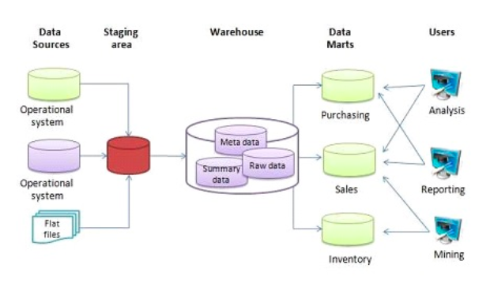
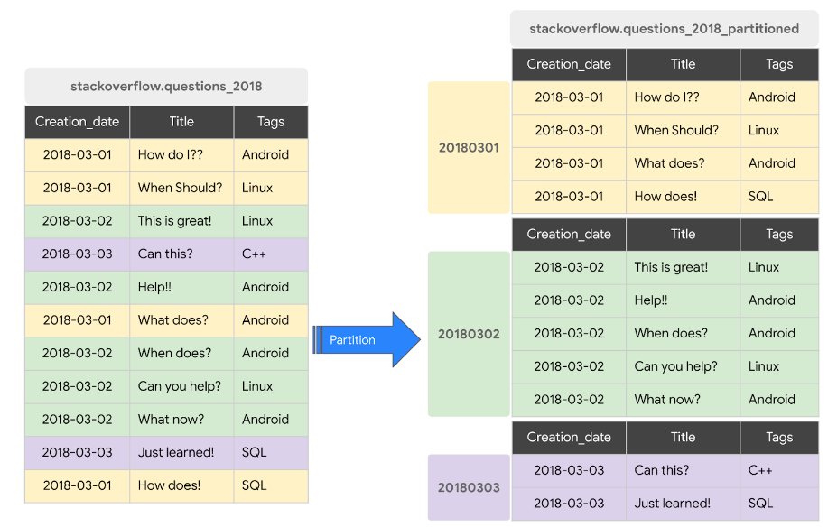
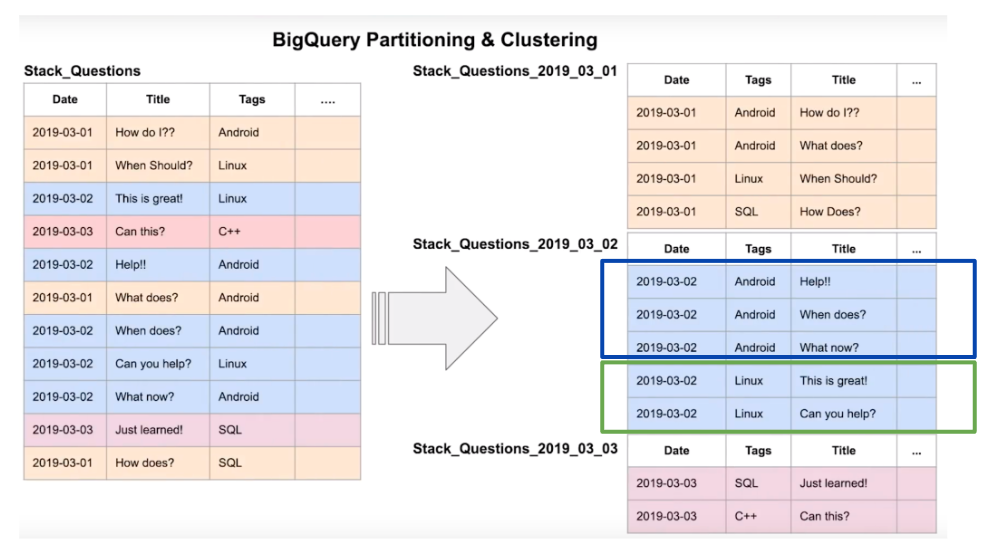
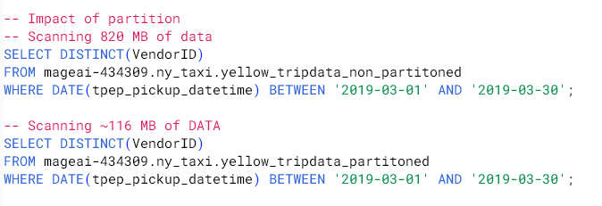
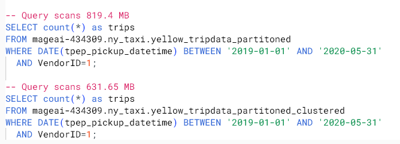
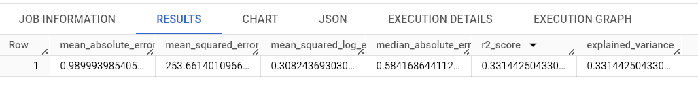
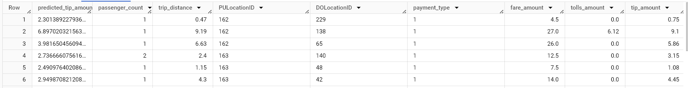
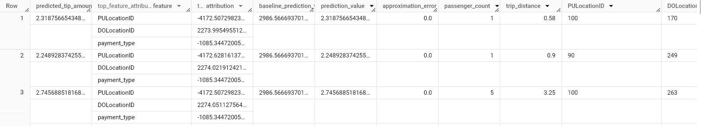
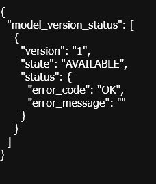

# Data Warehouse
OLTP vs OLAP
* Online Transaction Processing
  
  - Work as a database in backend services.
  
  - Fast data updated but small amount.
  
  - Normalized databases.
  
  - Increases productivity of end user.
  
* Online analytical processing
  
  - For discovering insight.
  
  - Mainly used by Data Scientist and Data Analytic.
  
  - Periodically update with large amount of data.
  
  - Denormalized databases.
  
  - Increases productivity of business manager, Data Analyst, and executives.

  

## Patition and Clustering in BigQuery

  

  

  Partition and cluster can reduce the query cost since it don't have to read the whole file.

  Partition only

   

  Partition and cluster

  

* Partition

  - Limit at 4,000 partitions
  - Cost known upfront.

* Cluster

  - Table with data size < 1GB will not show significant improve.
  - Can specify up to 4 clustering columns.
  - Clustering columns must be top-level and non-repeated columns.
  - Cost benefit unknown.

## When to use Clustering
  - Size per partition is less than 1 GB.
  - Partition result in large numbecr that exceed limits.
  - Partition result in your mutation operations modifying the majority of partitions in the table frequently. (ex. every few minutes)

## BigQuery Best practices

[](https://youtu.be/k81mLJVX08w&list=PL3MmuxUbc_hJed7dXYoJw8DoCuVHhGEQb&index=36)

## Internal of BigQuery

[](https://youtu.be/eduHi1inM4s&list=PL3MmuxUbc_hJed7dXYoJw8DoCuVHhGEQb&index=37)

## BigQuery Machine Learning

1. Create ML table
2. Create Model
3. Check feature
4. Evaluate Model



5. Predict
   


6. Predict with variables explain



## Deploy ML Model

1. Move ML model to GCS bucket.

```bash
bq --project_id <gcp project id> extract -m ny_taxi.tip_model gs://<bucket name>/tip_model
```

2. Make temporary directory.

```bash
mkdir /tmp/model
```

3. Copy ML model from GCS to temporary file.

```bash
gsutil cp -r gs://<bucket name>/tip_model /tmp/model
```

4. Make directory for store ML model file.

```bash
mkdir -p serving_dir/tip_model/1
```

5. Copy everything in temporary directory to newly create directory.

```bash
cp -r /tmp/model/tip_model/* serving_dir/tip_model/1
```

6. Get tensorflow docker.

```bash
docker pull tensorflow/serving
```

7. Run the model in docker.

```bash
docker run -p 8501:8501 --mount type=bind,source=$(pwd)/serving_dir/tip_model,target=/models/tip_model -e MODEL_NAME=tip_model -t tensorflow/serving &
```

Check status in 

```bash
http://localhost:8501/v1/models/tip_model
```



8. Post request.

```bash
curl -d '{"instances": [{"passenger_count":1, "trip_distance":12.2, "PULocationID":"193", "DOLocationID":"264", "payment_type":"2","fare_amount":20.4,"tolls_amount":0.0}]}' -X POST http://localhost:8501/v1/models/tip_model:predict
```

After post request we will get the predicted value.


