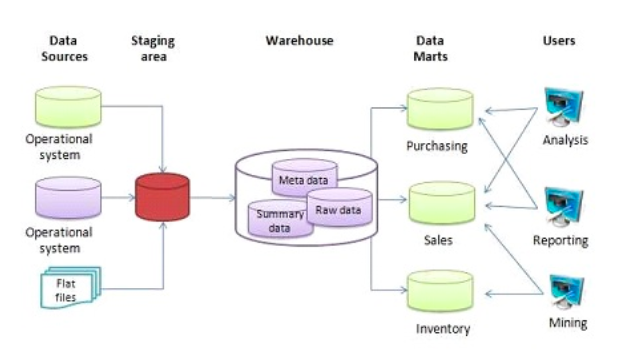
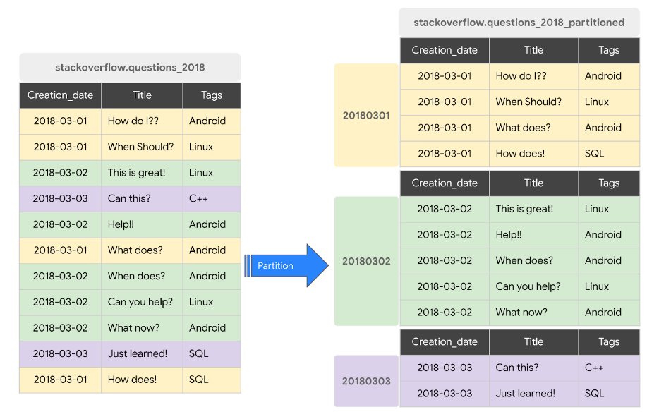
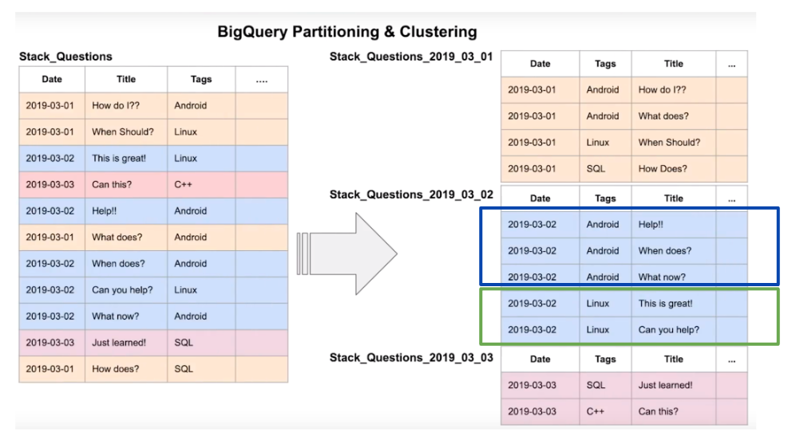

# Data Warehouse
OLTP vs OLAP
* Online Transaction Processing
  
  - Work as a database in backend services.
  
  - Fast data updated but small amount.
  
  - Normalized databases.
  
  - Increases productivity of end user.
  
* Online analytical processing
  
  - For discovering insight.
  
  - Mainly used by Data Scientist and Data Analytic.
  
  - Periodically update with large amount of data.
  
  - Denormalized databases.
  
  - Increases productivity of business manager, Data Analyst, and executives.

  

  # Patition and Clustering in BigQuery

  

  
