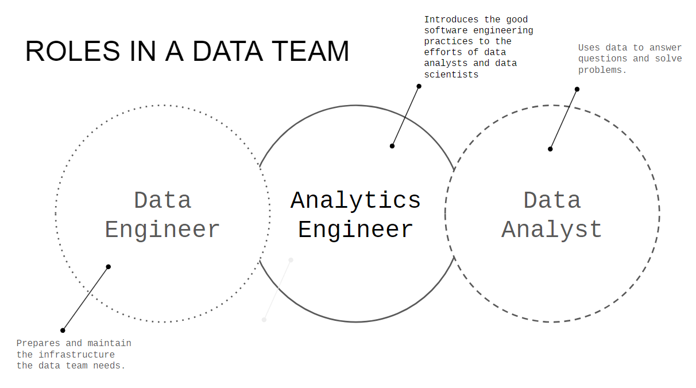
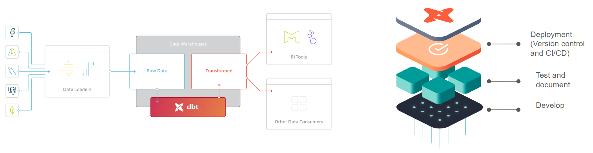
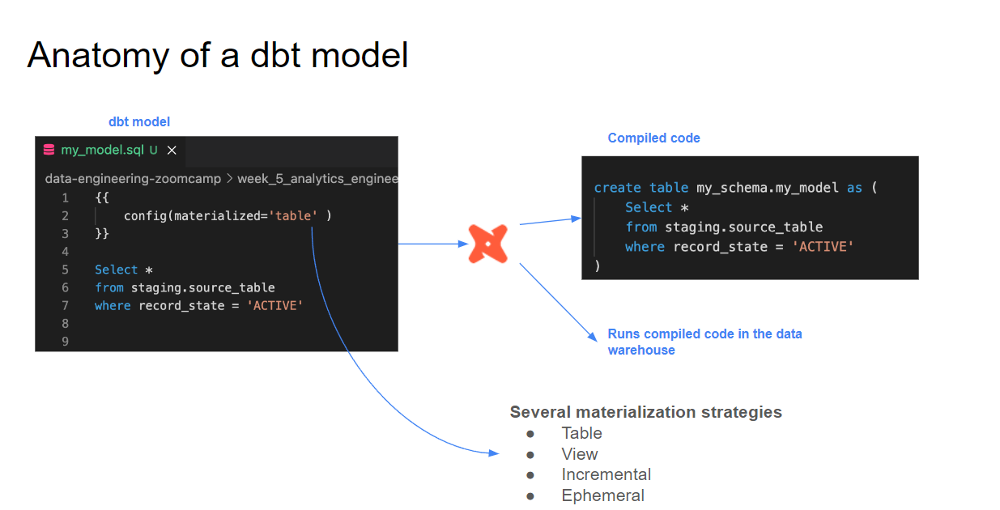

# Module 4: Analytics Engineering 
Goal: Transforming the data loaded in DWH into Analytical Views

### Prerequisites

- A running warehouse (BigQuery will be use in this module) 
- A set of running pipelines ingesting the project dataset (module 3 completed)
- The following datasets ingested from the course [Datasets list](https://github.com/DataTalksClub/nyc-tlc-data/): 
  * Yellow taxi data - Years 2019 and 2020
  * Green taxi data - Years 2019 and 2020 
  * fhv data - Year 2019. 

## Setting up your environment 
  
- Setting up dbt for using BigQuery (cloud)
- Open a free developer dbt cloud account following [this link](https://www.getdbt.com/signup/)
- Following these instructions to connect to your BigQuery instance[ Set up](dbt_cloud_setup.md)

## Content

### Introduction to analytics engineering

* What is analytics engineering?
  
  
  
* ETL vs ELT
  
  - ETL
    
      - Slightly more stable and compliant data analysis
  
      - Higher storage and computing costs

  - ELT
  
      - Faster and more flexible data analysis
  
      - Lower cost and lower maintenance

* Data modeling concepts (fact and dim tables)
  
  - Facts tables
    
      - Measurements, metrics or facts
    
      - Corresponds to a business process
    
      - “verbs” ex. sales, orders
   
   - Dimensions tables
     
      - Corresponds to a business identity
        
      - Provides context to a business process
        
      - “nouns” ex. customer, product

### What is dbt? 

* Introduction to dbt
  
Transformation workflow that used SQL to deploy analytics code following software engineering best practices like modularity, portability, CI/CD, and documentation.

## Starting a dbt project

- Create dbt project (Cloud or Terminal)
- Connect to BigQuery
- Connect to our repository (Github)

### dbt models

* Anatomy of a dbt model: written code vs compiled Sources

  
* Materialisations: table, view, incremental, ephemeral

  - Ephemeral
  
    Exist only for the duration of a single dbt run.
  
  - View
  
    Virtual table created by dbt which can be queried like normal table.
  
  - Table
    
    Physical representation of data that are created and stored in the database.
    
  - Incremental
    
    dbt feature that allow efficient update to existing tables, reducing the need for full data refreshes.
  
* Seeds, sources and ref

  - Sources 
      - The data loaded to our dwh that we use as sources for our models.
      - Configuration defined in the yml files in the models folder.
      - Used with the source macro that will resolve the name to the right schema, plus build the dependencies automatically .
      - Source freshness can be defined and tested.

  - Seeds
 
      - CSV files stored in our repository under the seed folder.
      - Benefits of version controlling.
      - Equivalent to a copy command.
      - Recommended for data that doesn’t change frequently.
      - Runs with 'dbt seed -s file_name'

  
* Jinja and Macros 
* Packages 
* Variables

### Testing and documenting dbt models
* Tests  
* Documentation 

## Deployment

## Visualising the transformed data
