# Module 4: Analytics Engineering 
Goal: Transforming the data loaded in DWH into Analytical Views

### Prerequisites

- A running warehouse (BigQuery will be use in this module) 
- A set of running pipelines ingesting the project dataset (module 3 completed)
- The following datasets ingested from the course [Datasets list](https://github.com/DataTalksClub/nyc-tlc-data/): 
  * Yellow taxi data - Years 2019 and 2020
  * Green taxi data - Years 2019 and 2020 
  * fhv data - Year 2019. 

## Setting up your environment 
  
- Setting up dbt for using BigQuery (cloud)
- Open a free developer dbt cloud account following [this link](https://www.getdbt.com/signup/)
- Following these instructions to connect to your BigQuery instance[ Set up](dbt_cloud_setup.md)


## Content

### Introduction to analytics engineering

* What is analytics engineering?
  
  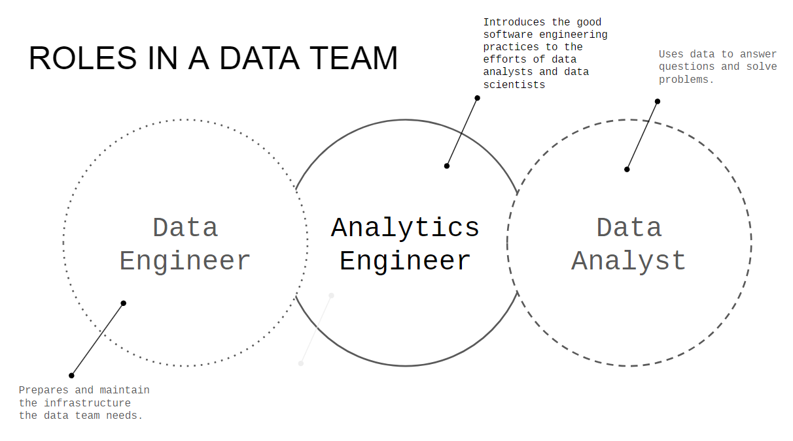
  
* ETL vs ELT
  
  - ETL
    
      - Slightly more stable and compliant data analysis
  
      - Higher storage and computing costs

  - ELT
  
      - Faster and more flexible data analysis
  
      - Lower cost and lower maintenance


* Data modeling concepts (fact and dim tables)
  
  - Facts tables
    
      - Measurements, metrics or facts
    
      - Corresponds to a business process
    
      - “verbs” ex. sales, orders
   
   - Dimensions tables
     
      - Corresponds to a business identity
        
      - Provides context to a business process
        
      - “nouns” ex. customer, product


### What is dbt? 

* Introduction to dbt
  
Transformation workflow that used SQL to deploy analytics code following software engineering best practices like modularity, portability, CI/CD, and documentation.

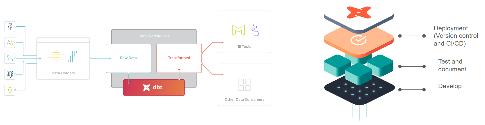


## dbt models

* Anatomy of a dbt model: written code vs compiled Sources

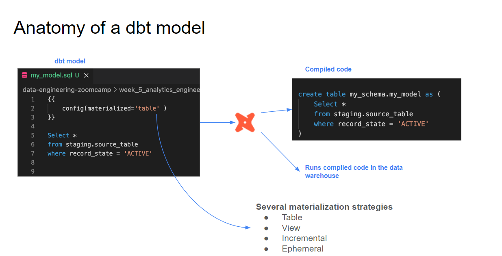
  
* Materialisations: table, view, incremental, ephemeral

  - Ephemeral
  
    Exist only for the duration of a single dbt run.
  
  - View
  
    Virtual table created by dbt which can be queried like normal table.
  
  - Table
    
    Physical representation of data that are created and stored in the database.
    
  - Incremental
    
    dbt feature that allow efficient update to existing tables, reducing the need for full data refreshes.
  
* Seeds, sources and ref

  - Sources 
      - The data loaded to our dwh that we use as sources for our models.
      - Configuration defined in the yml files in the models folder.
      - Used with the source macro that will resolve the name to the right schema, plus build the dependencies automatically .
      - Source freshness can be defined and tested.
        


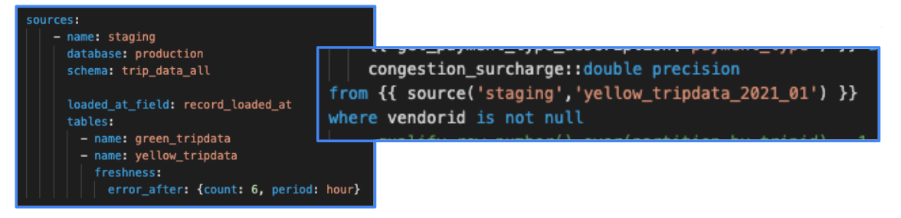

  - Seeds
 
      - CSV files stored in our repository under the seed folder.
      - Benefits of version controlling.
      - Equivalent to a copy command.
      - Recommended for data that doesn’t change frequently.
      - Runs with 'dbt seed -s file_name'

  - Ref
    
      - Macro to reference  the underlying tables and views that were building the data warehouse.
      - Run the same code in any environment, it will resolve the correct schema for you.
      - Dependencies are built automatically.

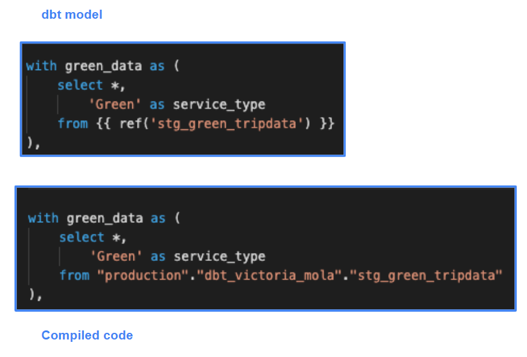
  
* Macros
  
  - Use control structures (e.g. if statements and for loops) in SQL. 
  - Use environment variables in your dbt project for production  deployments. 
  - Operate on the results of one query to generate another query. 
  - Abstract snippets of SQL into reusable macros — these are  analogous to functions in most programming languages.

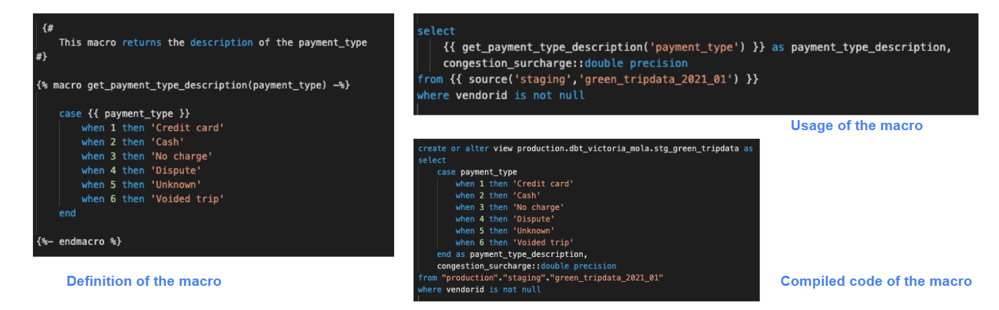

* Packages
  
  - Like libraries in other programming languages
  - Standalone dbt projects, with models and macros that tackle a specific problem area.
  - By adding a package to your project, the package's models and macros will become part of your own project.
  - Imported in the packages.yml file and imported by running dbt deps
  
* Variables

  - Variables are useful for defining values that should be used across the project
  - With a macro, dbt allows us to provide data to models for compilation
  - To use a variable we use the {{ var('...') }} function
  - Variables can defined in two ways:
      - In the dbt_project.yml file
      - On the command line

* Test

  - Assumptions that we make about our data 
  - Tests in dbt are essentially a select sql query
  - These assumptions get compiled to sql that returns the amount of failing records
  - Test are defined on a column in the .yml file
  - dbt provides basic tests to check if the column values are:
    
    - Unique
    - Not null 
    - Accepted values
    - A foreign key to another table
      
  - You can create your custom tests as queries

* Document

  - dbt provides a way to generate documentation for your dbt project and render it as a website. 
  - The documentation for your project includes:
    - Information about your project: 
      - Model code (both from the .sql file and compiled)
      - Model dependencies
      - Sources
      - Auto generated DAG from the ref and source macros
      - Descriptions (from .yml file) and tests 
    - Information about your data warehouse (information_schema):
      - Column names and data types
      - Table stats like size and rows
  - dbt docs can also be hosted in dbt cloud

* Deployment

- Process of running the models we created in our development environment in a production environment
- Development and later deployment allows us to continue building models and testing them without affecting our production environment
- A deployment environment will normally have a different schema in our data warehouse and ideally a different user
- A development - deployment workflow will be something like:

   - Develop in a user branch
   - Open a PR to merge into the main branch 
   - Merge the branch to the main branch
   - Run the new models in the production environment using the main branch 
   - Schedule the models


## Starting a dbt project

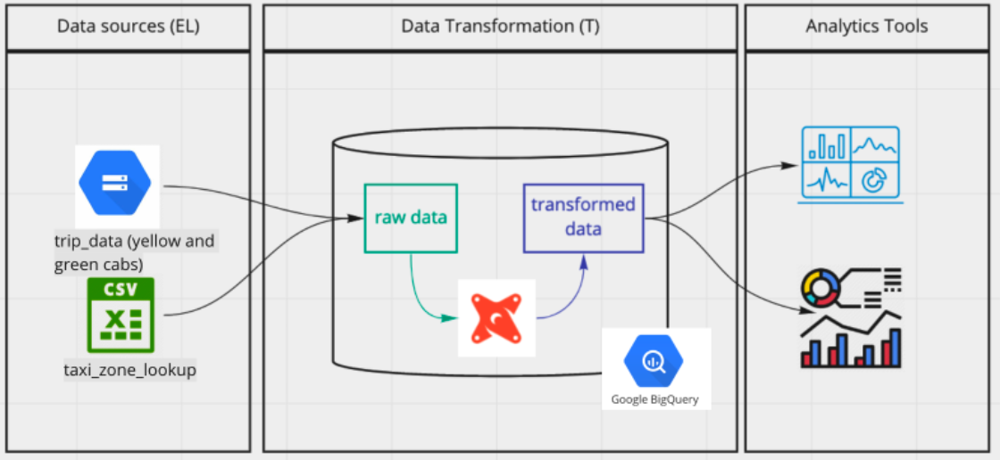

- Create dbt project (Cloud or Terminal)
- Connect to BigQuery
- Connect to our repository (Github)

In dbt cloud

- Create new git branch
- Import necessary package in [package file](taxi_rides_ny/packages.yml)
- Define data source which we stored in BigQuery on schema.yml at staging folder

```bash
version: 2

sources:
  - name: staging
    database: GCP-PJ-ID
    schema: trips_data_all

    tables:
      - name: green_tripdata
      - name: yellow_tripdata
```
  
- Create model for both data in staging folder [green taxi](taxi_rides_ny/models/staging/stg_green_tripdata.sql), [yellow taxi](taxi_rides_ny/models/staging/stg_green_tripdata.sql)
- Create core folder in models folder
- Create [dim_zones.sql](taxi_rides_ny/models/core/dim_zones.sql) to get service zone from csv file.
- Union three models to [fact_trips.sql](taxi_rides_ny/models/core/fact_trips.sql)
- Run dbt build

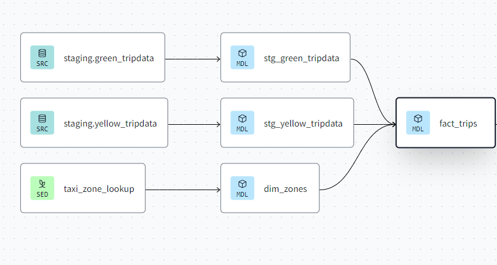

- Testing and documenting dbt models
- For testing we add it in schema.yml file for example

```bash
models:
  - name: stg_yellow_tripdata
    description: ""
    columns:
      - name: tripid
        data_type: string
        description: ""
        tests:
          - unique:
              severity : warn
          - not_null:
              severity : warn

```

This will test if our tripid is unique and not_null it will passed. However, if not it sill send us a warning but still passed.

For documents, it also adds in schema.yml file

```bash
models:
  - name: dim_zones
    description: >
      List of unique zones idefied by locationid. 
      Includes the service zone they correspond to (Green or yellow).

  - name: dm_monthly_zone_revenue
    description: >
      Aggregated table of all taxi trips corresponding to both service zones (Green and yellow) per pickup zone, month and service.
      The table contains monthly sums of the fare elements used to calculate the monthly revenue. 
      The table contains also monthly indicators like number of trips, and average trip distance. 
    columns:
      - name: revenue_monthly_total_amount
        description: Monthly sum of the the total_amount of the fare charged for the trip per pickup zone, month and service.
        tests:
            - not_null:
                severity: error
```

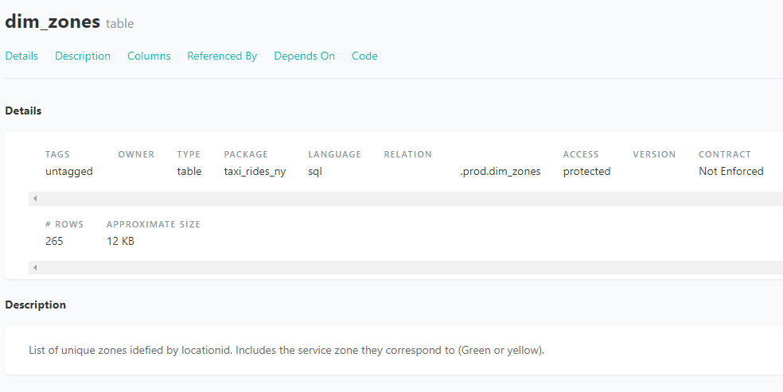

- Create the final product which is [dm_monthly_zone_revenue.sql](taxi_rides_ny/models/core/dm_monthly_zone_revenue.sql)

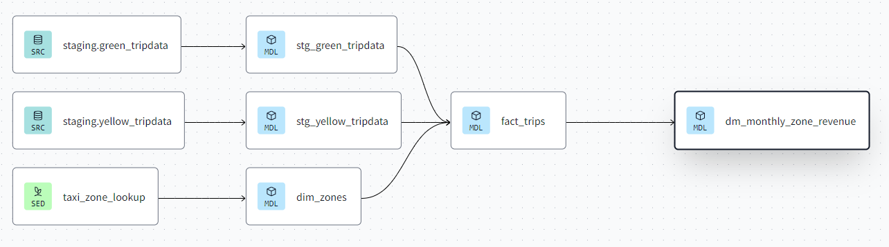

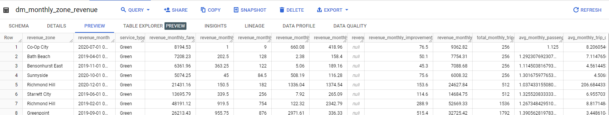

* Commit all code to the main branch before running the job.

- Deployment by
   - Create new environment  

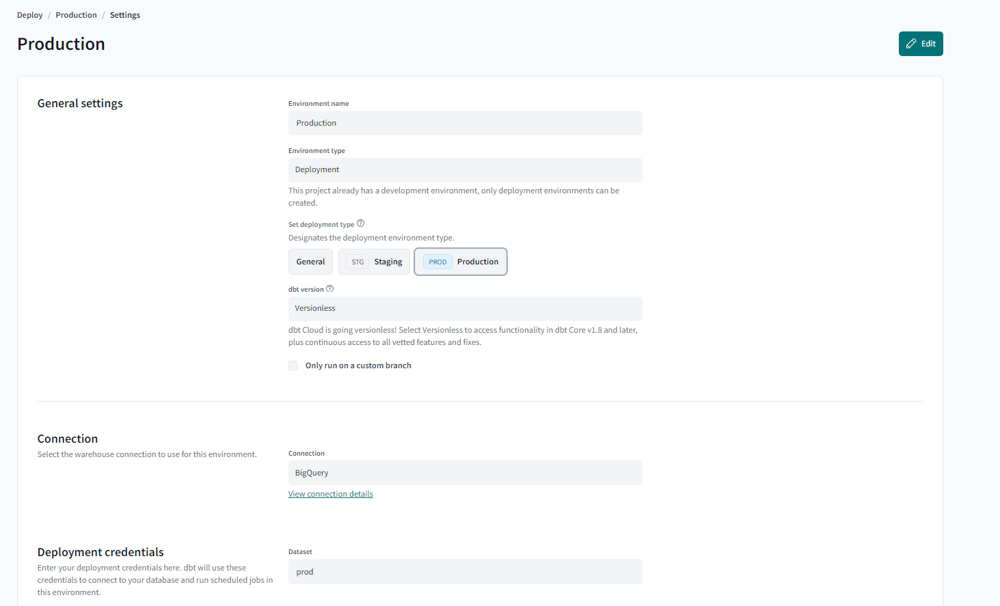

   - Create deploy job which will be run according to the setting (manual / trigger)

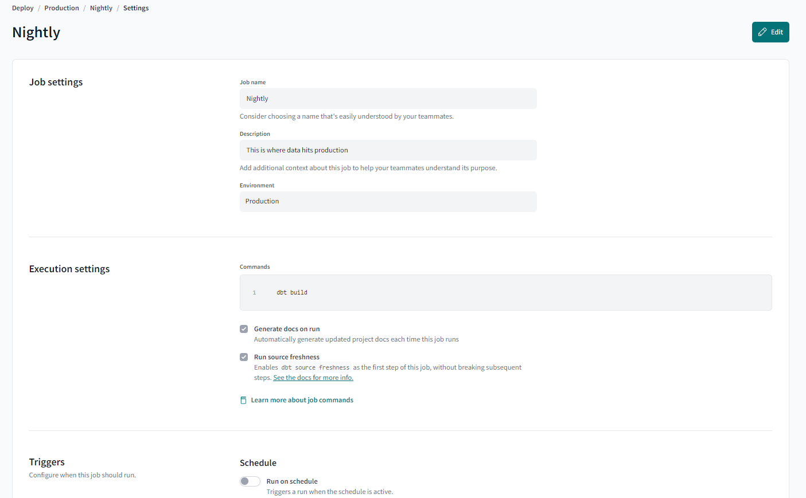

   - For CI/CD we can create CI job which will trigger if we make a pull request to the main branch to avoid breaking the production.

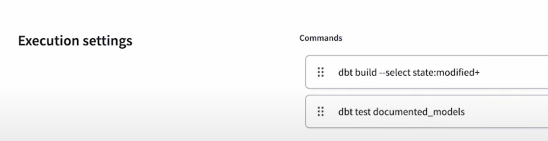

This will make the job to run every change in the code including their children and check if the document is made?. 

If these criteria are met, the pull request will be approved; otherwise, it will fail.

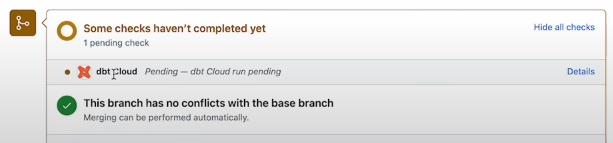
   
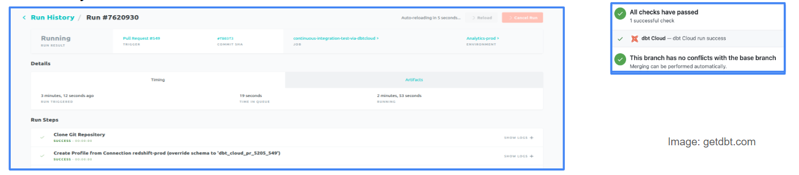

## Visualising the transformed data

We can create data visualization using Looker studio from data that created from the previous step.

- Create data source

  - BigQuery as source
  - The data from previous step will be saved in prod folder (name can be change in dbt environment).
  - In this module we will use fact_trips to see the overview.
 
  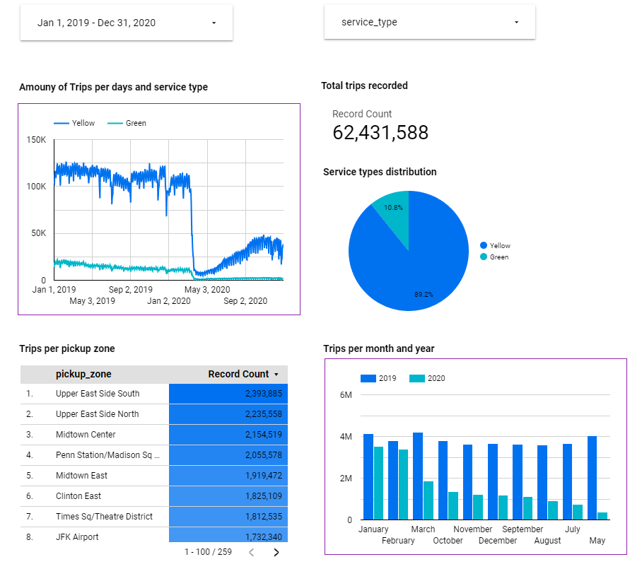
