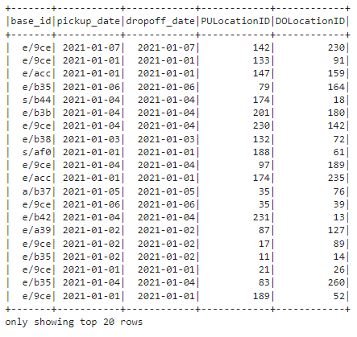
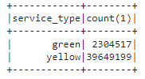

# Batch processing with Spark

## What is Batch?

Batch is a processing a chunk of data at regular intervals.

* Example of batch job
    - Weekly
    - Daily
    - Hourly
    - Every x minutes

* Advantage of Batch
    - Easy to manage
        - Know what tool used in each step
    - Retry
        - If failed can retry
    - Scalability
        - New machine more spark clusters.

* disadvantage of Batch
    - Delay
        - If we have hourly job but the process time took 15 min so we wiil get data every 1 hour 15 minutes.

## What is Spark?

Spark is Data processing engine which have 2 types which are Batch jobs and streaming

* When to use
    - Process big data
        - Spark divided data into partitions so instead of 1 core process 1 file, it will divide the data into partitions and process simultaneously.
    - Hard to express using SQL alone.
 
Install spark locally [HERE!](https://github.com/DataTalksClub/data-engineering-zoomcamp/tree/main/05-batch/setup)

In this Module I run spark locally on my pc.

Run in terminal before jupyter notebook init

```bash
export JAVA_HOME="/c/tools/jdk-11.0.24"
export PATH="${JAVA_HOME}/bin:${PATH}"
java --version
export HADOOP_HOME="/c/tools/hadoop-3.2.0"
export PATH="${HADOOP_HOME}/bin:${PATH}"
export SPARK_HOME="/c/tools/spark-3.3.2-bin-hadoop3"
export PATH="${SPARK_HOME}/bin:${PATH}"
export PYTHONPATH="${SPARK_HOME}/python/:$PYTHONPATH"
export PYTHONPATH="${SPARK_HOME}/python/lib/py4j-0.10.9.5-src.zip:$PYTHONPATH"
```

Run

```bash
jupyter notebook
```

Run spark core 

```bash
import pyspark
from pyspark.sql import SparkSession

spark = SparkSession.builder \
    .master("local[*]") \
    .appName('test') \
    .getOrCreate()
```
## Basic Command

* Read file
  
```bash
spark.read \
    .option("header", "true") \
    .csv('filename')

spark.read \
    .option("header", "true") \
    .parquet('filename')
```

* Create dataframe from pandas
  
```bash
spark.createDataFrame(df_pandas)
```

* Change column data type

```bash
from pyspark.sql import types
schema = types.StructType([
    types.StructField('hvfhs_license_num', types.StringType(), True),
    types.StructField('dispatching_base_num', types.StringType(), True),
    types.StructField('pickup_datetime', types.TimestampType(), True),
    types.StructField('dropoff_datetime', types.TimestampType(), True),
    types.StructField('PULocationID', types.IntegerType(), True),
    types.StructField('DOLocationID', types.IntegerType(), True),
    types.StructField('SR_Flag', types.StringType(), True)
])
```

* Divided data into partitions

```bash
df = spark.read \
    .option("header", "true") \
    .schema(schema) \
    .csv('fhvhv_tripdata_2021-01.csv')
df = df.repartition(24)
df.write.parquet('fhvhv/2021/01/')
```

Here we read csv file then define that this data must be divided to 24 partitions and save as parquet file. 

The result will be save in parquet format with 24 files.

* Used python expression in spark

```bash
from pyspark.sql import functions as F

def crazy_stuff(base_num):
    num = int(base_num[1:])
    if num % 7 == 0:
        return f's/{num:03x}'
    elif num % 3 == 0:
        return f'a/{num:03x}'
    else:
        return f'e/{num:03x}'

crazy_stuff_udf = F.udf(crazy_stuff, returnType=types.StringType())

df \
    .withColumn('pickup_date', F.to_date(df.pickup_datetime)) \
    .withColumn('dropoff_date', F.to_date(df.dropoff_datetime)) \
    .withColumn('base_id', crazy_stuff_udf(df.dispatching_base_num)) \
    .select('base_id', 'pickup_date', 'dropoff_date', 'PULocationID', 'DOLocationID') \
    .show()
```



* Using SQL query in spark 

Transform dataframe 'df_trips_data' to table name 'trips_data'

```bash
df_trips_data.registerTempTable('trips_data')
```

Now SQL query

```bash
spark.sql("""
SELECT
    service_type,
    count(1)
FROM
    trips_data
GROUP BY 
    service_type
""").show()
```



* Reduce partition of saved file

Sometimes when we save a result to a file it may result in too many partitions with small sizes which may cause reshuffling size problem.

```bash
df_result.coalesce(1).write.parquet('data/report/revenue/', mode='overwrite')
```

coalesce will used to reduce to x partition.

* Join

Join using same column name

 ```bash
df_join = df_green_revenue_tmp.join(df_yellow_revenue_tmp, on=['hour', 'zone'], how='outer')
```

Join using the same column but different name

 ```bash
df_result = df_join.join(df_zones, df_join.zone == df_zones.LocationID)
```

## Resilient Distributed Datasets
